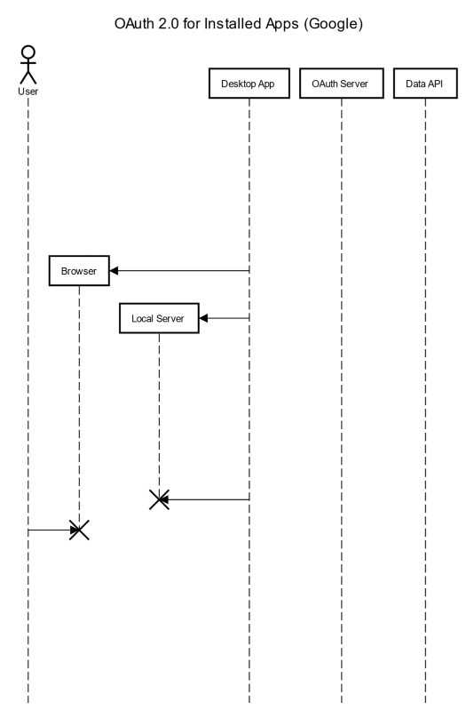
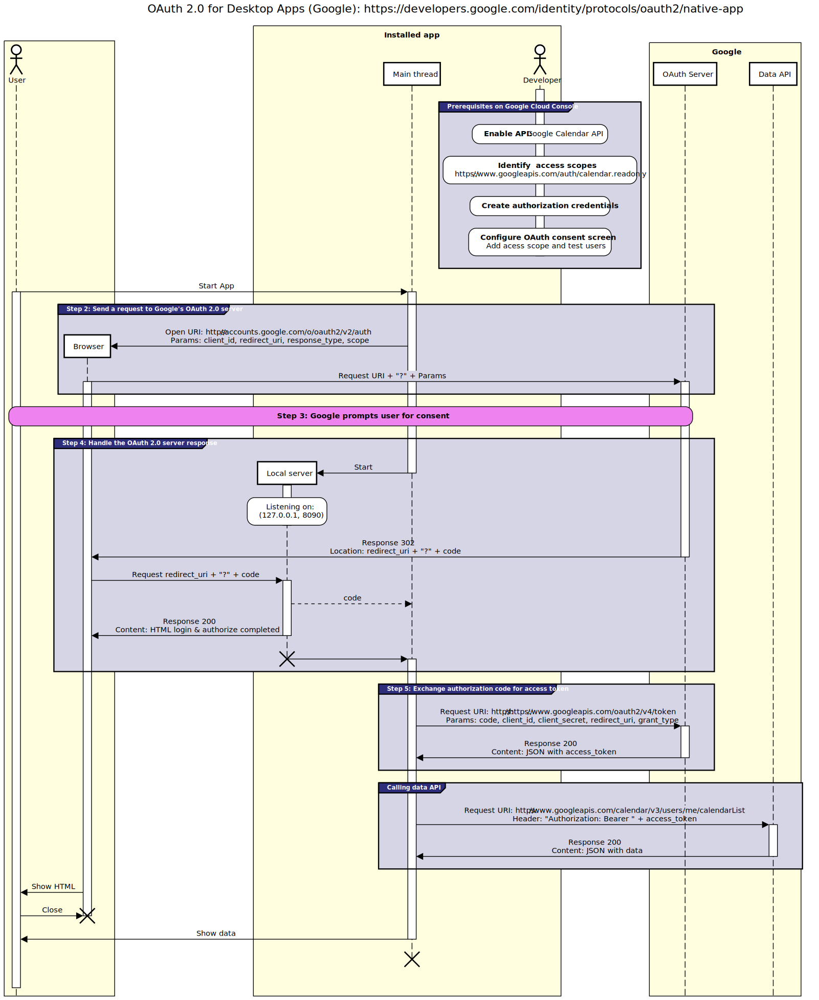

# Preguntas de examenes

## Pregunta 1

Un servidor recibe la siguiente petición http:

```http
GET /html/Sistemas Web.html HTTP/1.1
Host: sw2022.ehu.eus
Accept: text/html
Accept-Encoding: gzip,identity;q=0.5
Accept-Language: en-US,es-ES;q=0.8
User-Agent: Mozilla Windows Escritorio
```

La respuesta del servidor será (justifica la respuesta):

- a. 200 - OK, en el cuerpo del mensaje se enviará la página html.
- ***b. 400 - Bad Request, petición incorrecta.***
- c. 404 - File Not Found, el servidor no ha encontrado la página.
- d. 405 - Method Not Allowed, el método GET no implementado en servidor.

## Pregunta 2

Marca las afirmaciones correctas de las siguientes expresiones:

- ***a. HTTP es un protocolo sin estado. Para mantener una relación entre las solicitudes, los clientes web definen y envían Cookies al servidor.***
- b. Una vez que la Cookie está definida en el cliente, cada solicitud que el cliente hace al servidor incluye la información almacenada en la Cookie, y el servidor utiliza esta información para identificar al cliente.
- ***c. Las Cookies resuelven un problema del protocolo HTTP: es un protocolo sin estado, es decir, no tiene manera de mantener información persistente entre diferentes solicitudes.***
- d. Las Cookies son un tipo de spyware y pueden leer información personal almacenada en los ordenadores de los usuarios.
- ***e. Las Cookies son solo datos (no código), por lo tanto, no pueden leer ni eliminar información de los ordenadores de los usuarios.***

## Pregunta 3

<!--markdownlint-disable MD034-->
El siguiente programa en Python realiza una solicitud a la API de Gmail para obtener un mensaje que proviene de la dirección SW2019@gmail.com y que no ha sido leído:
<!--markdownlint-enable MD034-->

```python
cabeceras['User-Agent'] = 'Python Client'
cabeceras['Authorization'] = 'Bearer ' + access_token
params = {'q': 'from:SW2019@gmail.com is:unread'}
uri = 'https://www.googleapis.com/gmail/v1/users/me/messages?' + params
respuesta = requests.get(uri, headers=cabeceras)
print(respuesta.request)
```

Al realizar la solicitud, se obtiene la siguiente respuesta:

```json
Response status: 403 Forbidden
{
    error: 
    {
        code: 403, 
        message: 'Invalid userid specified in request/Delegation denied'
    }
}
```

¿Cuál es el problema?

- a. Hemos escrito mal el nombre del remitente en el programa.
- b. Nos hemos olvidado de incluir la cabecera Content-Type.
- c. No hemos pasado los parámetros a la función request.get().
- ***d. No hemos codificado el carácter @ en los parámetros, entre otros.***
- e. No tenemos mensajes sin leer.

> [!NOTE]
> Yo más bien diria que el problema es que TODA la variable params no se codifica correctamente al concatenarla con la URI, debería ser `uri = 'https://www.googleapis.com/gmail/v1/users/me/messages?q=from%3ASW2019%40gmail.com+is%3Aunread'` para lo cual se usa `urllib.parse`.

## Pregunta 4

Un servlet...

- ***a. Un servlet puede responder a cualquier solicitud, pero generalmente se utilizan en servidores web para recibir, procesar y responder a solicitudes HTTP.***
- b. Solo puede responder a solicitudes GET y POST.
- ***c. Es un objeto Java que extiende la clase HttpServlet.***
- d. No puede leer datos enviados a través de un formulario; de eso se encarga el contenedor de servlets (por ejemplo, TomCat).

## Pregunta 5

En la aplicación miApp, se desea asignar el siguiente URI a un nuevo servlet implementado en la clase miSitio.NewServlet:
<!--markdownlint-disable MD034-->
http://mydomain.com/miApp/DoLogin/NewServlet
<!--markdownlint-enable MD034-->

Completa el siguiente archivo de extensión:

```xml
<web-app>
    <display-name>miApp</display-name>
    <servlet>
        <servlet-name>____[NombreDelServlet]____</servlet-name>
        <servlet-class>____miSitio.NewServlet_____</servlet-class>
    </servlet>
    <servlet-mapping>
        <servlet-name>____[NombreDelServlet]____</servlet-name>
        <url-pattern>____/DoLogin/NewServlet____</url-pattern>
    </servlet-mapping>
</web-app>
```

## Pregunta 6

### Pregunta 6.1 <!-- omit in toc -->

El objeto HttpServletResponse...

- a. Permite convertir un documento XML en una solicitud HTTP.
- ***b. Utiliza el método getWriter() para devolver datos en formato de texto.***
- c. Facilita la realización de solicitudes HTTP cuyo contenido de respuesta está en formato XML.
- d. Es el objeto utilizado en los métodos doGet() y doPost() de Tomcat para referenciar a las solicitudes HTTP.
- ***e. Es el objeto utilizado en los métodos doGet() y doPost() de Tomcat para referenciar a las respuestas HTTP.***

### Pregunta 6.2 <!-- omit in toc -->

El objeto HttpServletRequest:

- a. Permite convertir un documento XML en una solicitud HTTP.
- b. Permite realizar solicitudes HTTP desde código Javascript.
- c. Facilita la realización de solicitudes HTTP cuyo contenido de respuesta está en formato XML.
- **d. Es el objeto utilizado en los métodos doGet() y doPost() de Tomcat para referenciar a las solicitudes HTTP.**
- e. Es el objeto utilizado en los métodos get() y post() de Google App Engine para referenciar a las solicitudes HTTP.

## Pregunta 7

<!--markdownlint-disable MD034-->
Una aplicación ubicada en Google App Engine tiene el siguiente archivo de extensión app.yaml. ¿Qué respuesta se obtiene si se solicita el recurso http://miappGAE.appspot.com/horaActual3? Razone su respuesta.
<!--markdownlint-enable MD034-->

```yaml
application: miappGAE
version: 1
runtime: python27
api_version: 1
threadsafe: yes

handlers:
‐ url: /js
static_dir: js
‐ url: /GoogleLogin
script: main2.app
‐ url: /horaMain
script: main3.app
‐ url: .*
script: main.app
‐ url: /horaActual
script: main3.app

libraries:
‐ name: webapp2
version: "2.5.2"
‐ name: jinja2
version: "2.6"
```

```python
import webapp2
class MainHandler(webapp2.RequestHandler):
    …

class MainHandler2(webapp2.RequestHandler):
    …

class MainHandler3(webapp2.RequestHandler):
    …

app = webapp2.WSGIApplication([
    ('/', MainHandler),
    ('/main', MainHandler2),
    ('/horaActual', MainHandler3),
], debug=True)
```

> 404 - File Not Found, el servidor no ha encontrado la página.
> En el archivo de extensión app.yaml, la URL /horaActual3 no está definida en la sección handlers.

## Pregunta 8

En OAuth 2.0, ¿a quién identifican las variables client_key y client_secret?

- a. Al usuario de la aplicación.
- b. A la instancia del servidor de la aplicación.
- c. Al programador y a la aplicación.
- ***d. A la aplicación.***
- e. Ninguna de las anteriores.

> [!NOTE]
> Las variables client_key y client_secret son iguales que las de consumer_key y consumer_secret solo que las primeras son para OAuth 2.0 y las segundas para OAuth 1.0.

## Pregunta 9

Para crear una aplicación en Google App Engine que solo tenga acceso a la API de Google Calendar... (elige la respuesta más adecuada):

- a. Se debe crear un proyecto en Google Cloud y registrar la aplicación en Google Calendar.
- b. En el proyecto de Google Cloud, se debe definir el callback_uri o redirect_uri.
- c. La aplicación solo debe registrarse en Google Calendar.
- ***d. Crear un proyecto en Google Cloud, inicializar App Engine en ese proyecto y crear credenciales para la aplicación.***
- e. Crear un proyecto en Google Cloud y no es necesario crear credenciales para la aplicación porque es de Google.

## Pregunta 10

Cuando se ejecuta una instancia de la clase PublishTweetHandler, se envía la siguiente solicitud a Twitter:

```python
class PublishTweetHandler(BaseHandler):
    def get(self):
        oauth_token = self.session['oauth_token']
        oauth_token_secret = self.session['oauth_token_secret']
        oauth_headers = {'oauth_token': oauth_token}
        autorizacion = createAuthHeader(...)
        method = 'POST'
        base_url = 'https://api.twitter.com/1.1/statuses/update.json'
        status = 'PruebaJunio2019'
        params = {'status': status}
        cabeceras = {
            'User-Agent': 'Google App Engine',
            'Content-Type': 'application/x-www-form-urlencoded',
            'Authorization': autorizacion
        }
        respuesta = requests.post(base_url, headers=cabeceras, data=params)
        logging.info(respuesta.text)
```

Nota: El valor de la cabecera 'Authorization' se calcula con la función createAuthHeader() y su valor es autorizacion.

```http
POST /1.1/statuses/update.json HTTP/1.1
Host: api.twitter.com
User-Agent: Google App Engine
Content-Type: application/x-www-form-urlencoded
Content-Length: 22
Authorization: autorizacion

status=PruebaJunio2019
```

## Pregunta 11

Al utilizar el método "GET" para enviar datos...

- a. ***Los datos están incluidos en el URI.***
- b. ***Los datos sólo se pueden enviar en un formulario.***
- c. ***La cantidad de información a enviar es limitada.***
- d. Es necesario indicar la longitud de los datos en el encabezado Content-Length .
- e. Es necesario indicar el tipo de datos en el encabezado Content-Type .
- f. Puede enviar una cadena JSON si el valor application/json se indica en el encabezado Content-Type .

## Pregunta 12

### Pregunta 12.1 <!-- omit in toc -->

Para enviar datos usando el método POST, se debe:

- a. Indicar la longitud de la solicitud en la cabecera Content-Length.
- ***b. La respuesta puede ser de tipo 302/303, por ejemplo, cuando un usuario inicia sesión en la sala.***
- c. Generalmente, los datos se indican en el cuerpo de la solicitud.
- d. El tamaño de los datos depende del MTU de bajo nivel, es decir, del tamaño máximo del campo de datos a nivel TCP.
- ***e. En la cabecera Content-Type se debe indicar el tipo de datos (formulario, json, etc.).***

### Pregunta 12.2 <!-- omit in toc -->

Cuando se emplea el método POST para enviar datos en el protocolo HTTP:

- a. Hay que indicar la longitud de la petición en la cabecera Content-Length.
- ***b. La respuesta puede tener un código 302/303.***
- ***c. Generalmente, los datos se incluyen en el cuerpo del mensaje de la petición.***
- d. El tamaño de los datos depende de la MTU de la capa inferior, es decir, del tamaño máximo del campo de datos de la capa TCP.
- ***e. Hay que indicar el tipo de los datos que se envían en la cabecera Content-Type.***

## Pregunta 13

Teniendo en cuenta el siguiente archivo de configuración:

```xml
<servlet>
    <servlet-name>DoLoginServlet</servlet-name>
    <servlet-class>DoLogin</servlet-class>
</servlet>
<servlet-mapping>
    <servlet-name>DoLoginServlet</servlet>
    <url-pattern>/do/Login</url-pattern>
<servlet-mapping>
```

¿Cuál es el URI apropiado para llamar al servlet llamado DoLoginServlet?
<!--markdownlint-disable MD034-->
- a. http://mydomain.com/myapp/DoLogin
- b. http://mydomain.com/myapp/DoLoginServlet
- c. http://mydomain.com/myapp/DoLogin/DoLoginServlet
- d. http://mydomain.com/myapp/DoLoginServlet/DoLogin
- e. ***Ninguna de las anteriores***
  - http://mydomain.com/myapp/do/Login
<!--markdownlint-enable MD034-->

## Pregunta 14

Para integrar solo la API de Dropbox en una aplicación de Google App Engine, elige la respuesta más adecuada:

- a. La aplicación solo necesita registrarse en Dropbox.
- b. Se debe crear un proyecto en Google Cloud y registrar la aplicación en Dropbox.
- c. Se debe crear un proyecto en Google Cloud y crear credenciales para la aplicación tanto en Google como en Dropbox.
- ***d. Se debe crear un proyecto en Google Cloud, inicializar App Engine en ese proyecto y crear credenciales para la aplicación en Dropbox.***
- e. El callback_uri o redirect_uri especificado al registrar la aplicación en Dropbox debe coincidir con el especificado al crear credenciales en Google.

## Pregunta 15

<!--markdownlint-disable MD034-->
Utilizando la documentación de la API de Gmail que se muestra a continuación, escribe una solicitud HTTP que obtenga los mensajes no leídos que provienen de "sw2019@ehu.es".
<!--markdownlint-enable MD034-->

```http
GET /gmail/v1/users/me/messages?q=from%3Asw2019%40ehu.es+is%3Aunread HTTP/1.1
Host: www.googleapis.com
Authorization: Bearer <access_token>
```

## Pregunta 16*





## Pregunta 17

El objeto XMLHttpRequest...

- a. Permite codificar una petición HTTP en XML.
- b. Se puede utilizar en la cabecera Content-Type para indicar que el formato del contenido de la petición es XML.
- c. Se utiliza en los métodos doGet() y doPost() de un servlet para referenciar la petición HTTP.
- ***d. Permite realizar peticiones HTTP desde código javascript.***
- e. Permite enviar el contenido de una petición HTTP en XML.

> [!NOTE]
> La e es parcialmente correcta ya que el objeto XMLHttpRequest permite enviar el contenido de una petición HTTP en XML pero también en otros formatos.

## Pregunta 18

Un estudiante programa la siguiente petición HTTP para responder a un tweet cuyo ID es 866344856981041155 y que tiene como autor al usuario de Twitter ocasquero (es decir, enviar un tweet en respuesta a otro tweet).

```http
POST https://api.twitter.com/1.1/statuses/update.json?status=Hola%2C+%40ocasquero&in_reply_to_status_id=866344856981041155
Host: api.twitter.com
User-Agent: Google App Engine
Authorization: OAuth    oauth_consumer_key="cChZNFj6T5R0TigYB9yd1w",
                        oauth_nonce="a9900fe68e2573b27a37f10fbad6a755",
                        oauth_signature="39cipBtIOHEEnybAR4sATQTpl2I%3D",
                        oauth_signature_method="HMAC-SHA1",
                        oauth_timestamp="1318467427",
                        oauth_token="NPcudxy0yU5T3tBzho7iCotZ3cnetKwcTIRlX0iwRl0",
                        oauth_version="1.0"
```

En respuesta a dicha petición, se recibe un código 403. A partir de la documentación adjunta, indica cuáles de las siguientes afirmaciones son correctas:

- **a. En dicha petición se ha enviado un tweet cuyo contenido ya ha sido publicado previamente.**
- b. En dicha petición se ha enviado un tweet cuyo contenido comienza por “D” o “M”.
- c. En dicha petición no se ha indicado el parámetro opcional media_ids.
- ***d. Con dicha petición se ha sobrepasado el número máximo de tweets que un usuario puede publicar a través del API en un intervalo de tiempo dado.***

> [!NOTE]
> La c es correcta ya que no se ha indicado el parámetro opcional media_ids pero no es causa de un error 403.

## Pregunta 19

Para que una aplicación cree un evento en la cuenta de Google Calendar de un usuario, utilizamos el siguiente código.

```python
scope = 'https://www.googleapis.com/auth/calendar'
calendarioID = 'addressbook#contacts@group.v.calendar.google.com'
cabeceras = {}
cabeceras['User-Agent'] = 'Python Client'
# suponer que access_token se ha definido y obtenido correctamente antes
cabeceras['Authorization'] = 'Bearer ' + access_token
cabeceras['Content-Type'] = 'application/json'
url = 'https://www.googleapis.com/calendar/v3/calendars/'+calendarioID+'/events'
cuerpo = { 'end' : { 'date': '2022-05-25' },
'start' : { 'date': '2022-05-24' },
'description': 'Sistemas Web',
'summary' : 'EXAMEN' }
cuerpo = json.dumps(cuerpo)
respuesta = requests.post(url, headers=cabeceras, data=cuerpo)
print(respuesta.status_code)
print(respuesta.content)
```

Al ejecutar la aplicación, nos devuelve el error 404 Not Found. Las causas de esta
respuesta pueden ser:

- ~~Hay que indicar la longitud de los datos en la cabecera Content-Length.~~
- ~~El cuerpo del mensaje no está correctamente formateado.~~
- El usuario no tiene un calendario con ese identificador.
  - Un error 404 Not Found sugiere que el recurso específico (en este caso, el calendario con el ID dado) no se puede encontrar. Esto es muy posible si el ID del calendario es incorrecto o si el usuario asociado con el token de acceso no tiene un calendario con ese ID.
- ~~No se ha definido correctamente la cabecera Content-Type.~~
- ~~Se ha definido mal el scope de la aplicación.~~

Tacha lo que no proceda y justifica por qué pueden ser validas o no cada una de las opciones.

> [!NOTE]
> Tengo dudas con la ultima opción ya que es posible que el error 404 sea porque no se le ha dado permisos a la aplicación para usar ese scope.

## Pregunta 20

A continuación, se muestra parte del código de un JSP.

```jsp
<%@ page import="java.util.*"%>
<% int i=0; %>
...
<body>
<% for(i=1; i<3; i++) { %>
Server Date: <%= new Date().toString() %><br/>
<% } %></br>
<script language="javascript">
for(i=2; i<<%= i %>; i++) {
var data = new Date();
document.write("Client Date: ");
document.write(data);
document.write("<br/>");
}
</script></body>
```

Suponiendo que el JSP se procesa en el servidor en la fecha Fri, 21-May-2022 08:33:47 GMT y se recibe en el navegador en la fecha Fri, 21-May-2022 08:33:50 GMT, escribe el contenido que se mostrará en el navegador.

```html
Server Date: Fri May 21 08:33:47 GMT 2022
Server Date: Fri May 21 08:33:47 GMT 2022
Client Date: Fri May 21 08:33:50 GMT 2022
```

## Pregunta 21

Describe detalladamente la estructura de una petición HTTP y pon un ejemplo.

Estructura:

- Cabecera
  - Metodo
    - Acción que se va a realizar.
  - URI
    - Identificador del recurso.
  - Cabeceras
    - Campos que se añaden a la petición para dar información adicional.
    - Formato: `Nombre: Valor`
    - [Ejemplos](https://developer.mozilla.org/es/docs/Web/HTTP/Headers):
      - Host - Dominio del servidor.
      - User-Agent - Identificador del navegador del cliente.
      - Accept - Tipos de contenido que acepta el cliente.
      - Accept-Language - Idiomas que acepta el cliente.
      - Accept-Encoding - Codificaciones que acepta el cliente.
      - Content-Type - Tipo de contenido que se envía.
      - Content-Length - Longitud del cuerpo.
      - Transfer-Encoding - Codificación de transferencia.
      - Cookie - Información de la sesión.
      - Referer - URI de la que viene la petición.
      - Authorization - Información de autenticación.
      - Cache-Control - Control de la cache.
- CR LF
  - Retorno de carro y salto de linea.
  - Indica el final de la cabecera.
- Cuerpo
  - Datos que se envían en la petición.

Ejemplo:

```http
GET /index.html HTTP/1.1
Host: www.example.com
User-Agent: Mozilla/5.0 (Windows NT 10.0; Win64; x64; rv:88.0) Gecko/20100101 Firefox/88.0
Accept: text/html,application/xhtml+xml,application/xml;q=0.9,image/webp,*/*;q=0.8
Accept-Language: es-ES,es;q=0.8,en-US;q=0.5,en;q=0.3
Accept-Encoding: gzip, deflate, br
```
