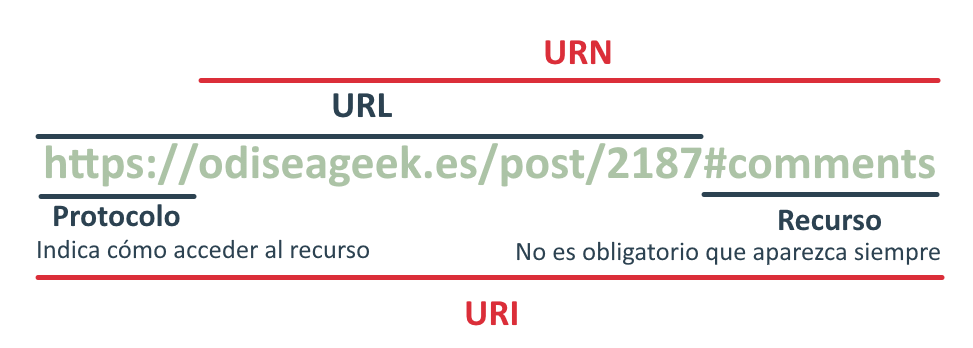

<!--markdownlint-disable-file MD041-->
# Teoria Sistemas Web <!-- omit from toc -->

> [!WARNING]
> Me voy a tomar licencias creativas para explicar las cosas ya que no me gusta mucho como esta explicado en las diapositivas.

- [1. HTTP](#1-http)
  - [1.1. Teoria](#11-teoria)
    - [1.1.1 Introducción](#111-introducción)
    - [1.1.2 Funcionamiento HTTP](#112-funcionamiento-http)
    - [1.1.3. Sintaxis Petición HTTP](#113-sintaxis-petición-http)
    - [1.1.4. Sintaxis Respuesta HTTP](#114-sintaxis-respuesta-http)
  - [1.2. Ejercicios](#12-ejercicios)
    - [1.2.1. Burp Suite](#121-burp-suite)
    - [1.2.2. Python](#122-python)
- [2. Web Scraping](#2-web-scraping)
- [3. Servidor Web](#3-servidor-web)
- [4. OAuth](#4-oauth)

# 1. HTTP

## 1.1. Teoria

### 1.1.1 Introducción

La web se basa en el intercambio de información.
Hay diferentes formas de intercambiar información pero la que nos ataña es HTTP.

HTTP es un protocolo de la capa de aplicación que busca obtener información en forma de hipertexto (recursos de la web) para mostrarlos en la aplicación que lo integra (navegadores normalmente).

HTTP sigue el modelo petición-respuesta. Un cliente hace una petición a un servidor y el servidor le responde.
La petición mas común coje dos parametros, el metodo y la URI.

- Metodos:
  - Los metodos CRUD son:
    - GET: Para obtener información
    - POST: Para enviar información
    - PUT: Para modificar información
    - DELETE: Para borrar información
  - Existen más metodos.
- URI:
  - Ahora para explicar que es la URI tenemos que explicar primero que es la URL y URN.
    - La URL (Uniform Resource Locator) indica la ubicación de un recurso en la web y el protocolo que se va a usar para acceder a el.
      - Ejemplo: <https://www.ehu.eus>
    - La URN (Uniform Resource Name) es un nombre único para un recurso en la web.
      - Ejemplo: <www.ehu.eus/index.html>
    - La URI (Uniform Resource Identifier) es una combinación de URL y URN.
      - Ejemplo: <https://www.ehu.eus/index.html>
      - 
      - La URI puede tener varios campos y su sintaxis es la siguiente:
        - `scheme:[//host[:port]][/]path[?query][#fragment]`
        - `scheme`: El protocolo que se va a usar.
        - `host`: El servidor al que se va a acceder.
        - `port`: El puerto por el que se va a acceder.
        - `path`: La ruta del recurso.
        - `query`: Los parametros de la petición.
        - `fragment`: La parte del recurso que se va a mostrar.
      - La URI tiene formado US-ASCII y se codifica en UTF-8 esto hace que caracteres especiales tengan que se codificados en hexadecimal.

HTTP ha pasado por varias versiones cuyas especificaciones se guardan en los memorandos de la IETF (Internet Engineering Task Force) llamados RFC (Request For Comments).

- HTTP/0.9: La primera versión de HTTP que solo permitía el metodo GET y no tenia cabeceras.
- HTTP/1.0: La segunda versión de HTTP que permitía varios metodos y cabeceras.
- HTTP/1.1: La tercera versión de HTTP que permitía conexiones persistentes y compresión de datos.
- HTTP/2: La cuarta versión de HTTP que permitía multiplexación de conexiones y compresión de cabeceras.
- HTTP/3: La quinta versión de HTTP que permitía conexiones seguras y multiplexación de conexiones.

### 1.1.2 Funcionamiento HTTP

Ahora voy a explicar el funcionamiento de HTTP con un ejemplo en profundidad.

1. El cliente quiere acceder a un recurso de la web.
2. Introduce la URI en el la aplicación (navegador).
3. La aplicación crea una petición HTTP con el metodo GET y la URI.
    1. La URI se divide en varios campos.
        1. El campo scheme indicara el protocolo que se va a usar.
           1. Por defecto supondremos que es HTTP.
        2. El campo host indicara el servidor al que se va a acceder.
            1. Como el host no es una IP que nuestro ordenador pueda entender, se tiene que traducir a una IP.
            2. Para ello se usa el DNS (Domain Name System) que traduce el host a una IP.
                1. El DNS puede estar en el router, en el ISP, en un servidor DNS o cacheado en el ordenador.
        3. El campo port indicara el puerto por el que se va a acceder.
            1. Si no se especifica el puerto se usara el puerto 80 por defecto.
        4. El campo path indicara la ruta del recurso.
        5. El campo query indicara los parametros de la petición.
        6. El campo fragment indicara la parte del recurso que se va a mostrar.
4. La aplicación establece una conexión TCP/IP con el servidor.
    1. TCP (Transmission Control Protocol) es un protocolo de transporte confiable que garantiza la entrega ordenada y sin errores de los datos.
    2. IP (Internet Protocol) es un protocolo de red que se encarga de enrutar los paquetes de datos a través de la red.
5. Después de establecer la conexión, la aplicación envía la petición HTTP al servidor a través de la conexión TCP/IP.
6. El servidor recibe la petición y la procesa.
    1. Comprueba que el recurso existe.
    2. Comprueba que el cliente tiene permiso para acceder al recurso.
    3. Analiza las cabeceras de la petición para saber que y como tiene que devolver el recurso.
7. El servidor crea una respuesta HTTP con el código de estado y el recurso.
8. La aplicación recibe la respuesta a través de la conexión TCP/IP y la muestra al usuario.
    1. Si el código de estado es 100, se seguirá procesando la petición.
    2. Si el código de estado es 200, se mostrará el recurso.
    3. Si el código de estado es 300, se redirigirá a otra URI.
    4. Si el código de estado es 400, habrá un error en la petición.
    5. Si el código de estado es 500, habrá un error en el servidor.
9. El usuario ve el recurso y puede interactuar con él.

#### Código de estado más comunes <!-- omit from toc -->

- 1XX
  - 100: Continue - Se seguirá procesando la petición.
  - 101: Switching Protocols - Se cambiará el protocolo.
  - 102: Processing - Se sigue procesando la petición.
  - 103: Checkpoint - Se reanuda la petición.
- 2XX
  - 200: OK - Todo ha ido bien.
  - 201: Created - Se ha creado un recurso.
  - 203: Non-Authoritative Information - Creado pero no se puede acceder a la información.
  - 204: No Content - No hay contenido.
  - 205: Reset Content - Se ha reseteado el contenido.
  - 206: Partial Content - Se ha obtenido parte del contenido.
  - 207: Multi-Status - Archivo XML con varias respuestas.
- 3XX
  - 300: Multiple Choices - Varias opciones para obtener el recurso.
  - 301: Moved Permanently - Se ha movido el recurso permanentemente.
  - 302: Moved Temporarily - Se ha movido el recurso temporalmente.
  - 303: See Other - Se ha movido el recurso pero no se redirige a el.
  - 304: Not Modified - No se ha modificado el recurso.
  - 305: Use Proxy - Se tiene que usar un proxy.
- 4XX
  - 400: Bad Request - Petición mal formada.
  - 401: Unauthorized - No autorizado.
  - 402: Payment Required - Se necesita un pago.
  - 403: Forbidden - Prohibido.
  - 404: Not Found - No se ha encontrado el recurso.
  - 405: Method Not Allowed - Metodo no permitido.
  - 406: Not Acceptable - No se acepta el contenido.
  - 407: Proxy Authentication Required - Se necesita autenticación en el proxy.
  - 408: Request Timeout - Tiempo de espera agotado.
  - 409: Conflict - Conflicto.
  - 410: Gone - Recurso eliminado permanentemente (En caso de no ser permanente se usa el 404).
  - 411: Length Required - Falta la longitud del cuerpo.
  - 414: URI Too Long - URI demasiado larga.
  - 423: Locked - Recurso bloqueado.
  - 429: Too Many Requests - Demasiadas peticiones.
- 5XX
  - 500: Internal Server Error - Error interno del servidor.
  - 501: Not Implemented - Alguna funcion del servidor no esta implementada.
  - 502: Bad Gateway - Error en la pasarela.
  - 503: Service Unavailable - Servicio no disponible.
  - 504: Gateway Timeout - Tiempo de espera agotado en la pasarela.
  - 505: HTTP Version Not Supported - Versión de HTTP no soportada.
  - 509: Bandwidth Limit Exceeded - Se ha excedido el ancho de banda.
  - 510: Not Extended - Extension no soportada.
  - 511: Network Authentication Required - Se necesita autenticación en la red.

### 1.1.3. Sintaxis Petición HTTP

Sintaxis de una petición HTTP:

- Cabecera
  - Metodo
    - Acción que se va a realizar.
  - URI
    - Identificador del recurso.
  - Cabeceras
    - Campos que se añaden a la petición para dar información adicional.
    - Formato: `Nombre: Valor`
    - [Ejemplos](https://developer.mozilla.org/es/docs/Web/HTTP/Headers):
      - Host - Dominio del servidor.
      - User-Agent - Identificador del navegador del cliente.
      - Accept - Tipos de contenido que acepta el cliente.
      - Accept-Language - Idiomas que acepta el cliente.
      - Accept-Encoding - Codificaciones que acepta el cliente.
      - Content-Type - Tipo de contenido que se envía.
      - Content-Length - Longitud del cuerpo.
      - Transfer-Encoding - Codificación de transferencia.
      - Cookie - Información de la sesión.
      - Referer - URI de la que viene la petición.
      - Authorization - Información de autenticación.
      - Cache-Control - Control de la cache.
      - If-Modified-Since - Fecha de la última modificación.
      - If-None-Match - Etiqueta de la entidad.
- CR LF
  - Retorno de carro y salto de linea.
  - Indica el final de la cabecera.
- Cuerpo
  - Datos que se envían en la petición.

### 1.1.4. Sintaxis Respuesta HTTP

Sintaxis de una respuesta HTTP:

- Cabecera
  - Versión
    - Versión de HTTP que se usa.
  - Status
    - Status de la respuesta.
    - Code + Reason
      - Code: Código de estado.
      - Reason: Descripcion del código de estado.
  - Cabeceras
    - Campos que se añaden a la respuesta para dar información adicional.
    - Formato: `Nombre: Valor`
    - [Ejemplos](https://developer.mozilla.org/es/docs/Web/HTTP/Headers):
      - Server - Servidor que ha respondido.
      - Content-Type - Tipo de contenido de la respuesta.
      - Content-Length - Longitud del cuerpo.
      - Set-Cookie - Información de la sesión.
      - Location - URI a la que se redirige.
      - Cache-Control - Control de la cache.
      - Date - Fecha de la respuesta.
      - Last-Modified - Fecha de la última modificación.
      - ETag - Etiqueta de la entidad.

- CR LF
  - Retorno de carro y salto de linea.
  - Indica el final de la cabecera.
- Cuerpo
  - Datos que se envían en la respuesta.

#### Cookies <!-- omit from toc -->

Las cookies son pequeños archivos que se guardan en el ordenador del cliente para guardar información de la sesión.
Las cookies se guardan en el navegador y se envían en cada petición HTTP.

El flujo de las cookies en eGela es el siguiente:

1. El cliente hace una petición a eGela.
2. Se le redirige a la pantalla de inicio de sesión y se le asigna una cookie temporal.
   1. El cliente introduce el usuario y la contraseña.
3. El navegador envia estos datos junto con la cookie temporal y un token del formulario.
   1. El token del formulario es un token que se genera en el servidor y se envia en el formulario para evitar ataques CSRF (Cross-Site Request Forgery).
4. El servidor enviará una cookie permanente y redirigirá al cliente a un script que validará la sesión.
5. El script validará la sesión y redirigirá al cliente a la página principal.

#### Cache <!-- omit from toc -->

La cache es un metodo de almacenamiento temporal de recursos para mejorar la eficiencia y reducir el tiempo de respuesta.
En HTTP se pueden usar varias cabeceras para controlar la cache.

- Peticiones:
  - Cache-Control
  - If-Modified-Since
  - If-None-Match
  - ...
- Respuestas:
  - Cache-Control
  - Last-Modified
  - ETag
  - ...

El flujo de la cache es el siguiente:

1. El navegador obtiene un recurso, por ejemplo una imagen, por primera vez.
2. El servidor envía el recurso con las cabeceras de cache.
   1. Cache-Control: Cuando durará el recurso en la cache.
   2. Last-Modified: Fecha de la última modificación.
   3. ETag: Etiqueta de la entidad.
3. Cuando el navegador vuelva a pedir el recurso, enviará las cabeceras de cache.
   1. Cache-Control: El tiempo maximo para que un recurso se considere fresco.
   2. If-Modified-Since: Fecha de la última modificación.
   3. If-None-Match: Etiqueta de la entidad.
4. El servidor comprobara que:
   1. El recurso ha expirado.
   2. El recurso ha sido modificado.
      1. Diferencia entre Last-Modified y ETag.
5. El servidor responderá con:
   1. 200: Si alguna condición no se cumple.
   2. 304: Si el recurso no ha sido modificado.

#### Content-Length vs Transfer-Encoding <!-- omit from toc -->

- Content-Length
  - Los mensajes se envían una vez procesados.
  - El troceado depende del MTU (Maximum Transmission Unit).
- Transfer-Encoding
  - Los mensajes se envían en trozos.
  - El troceado depende del servidor y es a nivel de aplicación.

## 1.2. Ejercicios

### 1.2.1. Burp Suite

#### Obtener el directorio raíz de un servidor web <!-- omit from toc -->

```http
GET / HTTP/1.1
Host: www.ehu.eus


```

#### Obtener el svg de twitter <!-- omit from toc -->

```http
GET /o/upv-ehu-campusa-theme/images/custom/campusa/ic-twitter.svg HTTP/1.1
Host: www.ehu.eus


```

#### Mandar formulario con GET <!-- omit from toc -->

```http
GET /processForm?dni=11111111 HTTP/1.1
Host: gae-sw-2017.appspot.com

```

#### Mandar formulario con POST <!-- omit from toc -->

```http
POST /processForm HTTP/1.1
Host: gae-sw-2017.appspot.com
Content-Length: 12

dni=11111111
```

#### Login en egela <!-- omit from toc -->

```http
GET /login/index.php HTTP/1.1
host: egela.ehu.eus


```

```http
POST /login/index.php HTTP/1.1
Host: egela.ehu.eus
Content-Type: application/x-www-form-urlencoded
Cookie: MoodleSessionegela=XXXXXXXXXXXXXXXXXXXXXXXXXXXXXXXX

username=alumno&password=alumno&logintoken=XXXXXXXX
```

```http
GET /login/index.php?testsession=XXXXX HTTP/1.1
host: egela.ehu.eus
cookie: MoodleSessionegela=XXXXXXXXXXXXXXXXXXXXXXXXXXXXXXXX


```

```http
GET / HTTP/1.1
host: egela.ehu.eus
cookie: MoodleSessionegela=XXXXXXXXXXXXXXXXXXXXXXXXXXXXXXXX


```

### 1.2.2. Python

#### Obtener el aspx de Chunked <!-- omit from toc -->

```python
import requests

metodo="GET"
uri="https://www.httpwatch.com/httpgallery/chunked/chunkedimage.aspx"
cabeceras={'Host': 'www.httpwatch.com'}
cuerpo=""
response = requests.request(metodo, uri, headers=cabeceras, data=cuerpo)

i=0
print("Status: " + str(response.status_code))
print("Reason: " + response.reason)
for cabecera in response.headers:
    i+=1
    print(str(i)+ " " + cabecera + ": " + response.headers[cabecera])

fichero = open("imagen.jpg", "wb")
fichero.write(response.content)
fichero.close()
```

#### Seguir redirecciones manualmente <!-- omit from toc -->

```python
import requests

print("===PRIMERA RESPUESTA===")
metodo = "GET"
uri = "http://egela.ehu.eus/"
cabeceras = {'Host' : 'egela.ehu.eus'}
cuerpo = ""
respuesta = requests.request(metodo, uri, headers=cabeceras, data=cuerpo, allow_redirects=False)


print(respuesta.status_code)
print(respuesta.headers)
i=0
for cabeceras in respuesta.headers:
    i += 1
    print(i, cabeceras, respuesta.headers[cabeceras])
print(respuesta.text)

print("===SEGUNDA RESPUESTA===")
metodo = "GET"
uri = respuesta.headers['Location']
cabeceras = {'Host' : uri.split('/')[2]}
cuerpo = ""
respuesta = requests.request(metodo, uri, headers=cabeceras, data=cuerpo, allow_redirects=False)

print(respuesta.status_code)
print(respuesta.headers)
i=0
for cabeceras in respuesta.headers:
    i += 1
    print(i, cabeceras, respuesta.headers[cabeceras])
print(respuesta.text)

print("===TERCERA RESPUESTA===")
metodo = "GET"
uri = respuesta.headers['Location']
cabeceras = {'Host' : uri.split('/')[2]}
cuerpo = ""
respuesta = requests.request(metodo, uri, headers=cabeceras, data=cuerpo, allow_redirects=False)

print(respuesta.status_code)
print(respuesta.headers)
i=0
for cabeceras in respuesta.headers:
    i += 1
    print(i, cabeceras, respuesta.headers[cabeceras])
print(respuesta.text)

fichero = open("ejemplo2.html", "wb")
fichero.write(respuesta.content)
fichero.close()
```

#### Obtener la letra del DNI con GET <!-- omit from toc -->

```python
import requests

numero = input("Ingrese un número: ")
metodo="GET"
uri="http://gae-sw-2017.appspot.com/processForm?dni="+numero
cabecera={"Host": "gae-sw-2017.appspot.com", "Content-Lenght": "12"}
cuerpo=""

respuesta = requests.request(metodo, uri, headers=cabecera, data=cuerpo, allow_redirects=False)

print("DNI: " + respuesta.text)
```

#### Obtener la letra del DNI con POST <!-- omit from toc -->

```python
import requests

numero = input("Ingrese un número: ")
metodo="POST"
uri="http://gae-sw-2017.appspot.com/processForm"
cabecera={"Host": "gae-sw-2017.appspot.com", "Content-Lenght": "12", "Content-Type": "application/x-www-form-urlencoded"}
cuerpo="dni="+numero

respuesta = requests.request(metodo, uri, headers=cabecera, data=cuerpo, allow_redirects=False)

print("DNI: " + respuesta.text)
```

# 2. Web Scraping

El web scraping es una técnica que se usa para obtener información HTML de la web.
DOM (Document Object Model) es una representación de la estructura de un documento HTML.
La información puede ser estática o dinámica.

- Estatica
  - La información es estática y se puede obtener con una petición HTTP.
  - Siempre se obtiene la misma información.
- Dinámica
  - La información dinamica puede ser ejecutada de dos formas:
    - Cliente
      - El navegador ejecuta el código JavaScript y modifica el DOM.
      - La información no se puede obtener con una petición HTTP, hay que ejecutar el código.
    - Servidor
      - El servidor ejecuta el código y modifica el DOM.
      - PHP, JSP...
      - Al ser el servidor el que ejecuta el código, la información se puede obtener con una petición HTTP, se percibe como estática.

Como existen dos formas de obtener la información, hay dos formas de hacer web scraping (Python):

- Requests
  - Se obtiene la información estática.
  - Se puede obtener la información con una petición HTTP.
  - No es capaz de ejecutar JavaScript.
- Selenium
  - Se obtiene la información dinámica.
  - Se puede obtener la información con una petición HTTP.
  - Es capaz de ejecutar JavaScript.

Una vez obtenido el DOM usamos librerias como BeautifulSoup para obtener la información que queremos.

# 3. Servidor Web


# 4. OAuth

OAuth es un protocolo de autorización que permite a una aplicación obtener acceso a los recursos de un usuario en un servidor sin tener que compartir las credenciales del usuario.

OAuth se basa en tokens que se intercambian entre el cliente y el servidor.

- Usuario
  - Persona que tiene los recursos.
- Cliente
  - Aplicación que quiere acceder a los recursos del usuario.
- Servidor de autorización
  - Servidor que autoriza al cliente a acceder a los recursos del usuario.
- Servidor de recursos
  - Servidor que tiene los recursos del usuario.

El flujo de OAuth es el siguiente:

1. El cliente hace una peticion al servidor de autorización (resulta en la pantalla de inicio de sesion).
2. El usuario inicia sesion lo que genera un codigo de autorización.
3. El cliente recibe el codigo de autorización y lo intercambia por un token de acceso con el servidor de autorización.
4. El cliente hace una peticion al servidor de recursos con el token de acceso.
5. El servidor de recursos valida el token y devuelve los recursos.
6. El cliente recibe los recursos.
